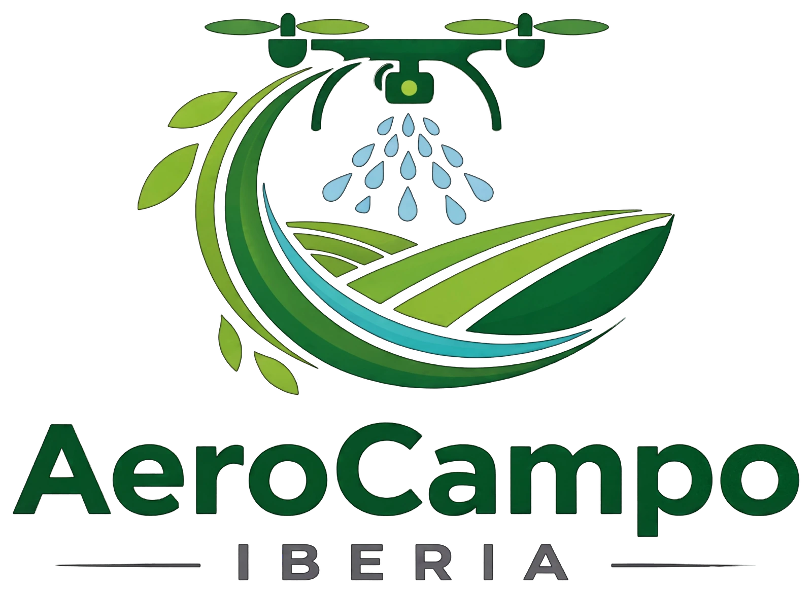
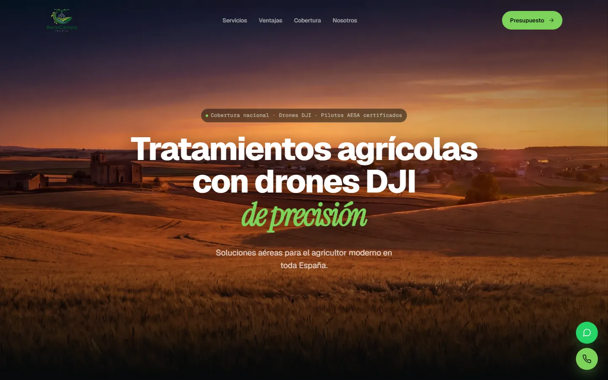

<div align="center">



# AeroCampo Iberia — Sitio Web

**Landing page corporativa para una empresa de tratamientos agrícolas con drones.**
Next.js 16 sobre Cloudflare Workers, con formulario de contacto que envía email
desde el propio Worker — sin backend, sin base de datos y sin servicios de terceros.

[](https://aerocampo.es)

[](https://nextjs.org)
[](https://react.dev)
[](https://www.typescriptlang.org)
[](https://tailwindcss.com)
[](https://workers.cloudflare.com)

</div>



---

## Qué es

Sitio web de una sola página (más dos páginas legales) para **AeroCampo Iberia**,
empresa de aplicación aérea de fitosanitarios y fertilizantes con drones DJI.

El encargo pedía tres cosas: que cargara rápido en móvil desde una finca con mala
cobertura, que posicionara en búsquedas locales, y que los presupuestos llegaran
al correo de la empresa sin pagar una suscripción mensual a ningún servicio de
formularios. El stack sale de ahí.

## Stack

| Capa | Tecnología |
|---|---|
| Framework | **Next.js 16** (App Router) + **React 19** |
| Lenguaje | **TypeScript 5** |
| Estilos | **Tailwind CSS v4** |
| Animación | **Framer Motion** (contadores y reveals) |
| Hosting | **Cloudflare Workers** vía [OpenNext](https://opennext.js.org/cloudflare) |
| Email | `send_email` binding nativo de Workers + **mimetext** |
| Fuentes | Geist, Geist Mono, Instrument Serif (self-hosted por `next/font`) |

## Decisiones técnicas

### Email sin servicio de formularios

El endpoint [`app/api/contact/route.ts`](app/api/contact/route.ts) compone un
mensaje MIME con `mimetext` y lo envía por el binding `send_email` que Cloudflare
expone dentro del Worker. Cero dependencias externas, cero coste por envío, y el
`Reply-To` apunta al lead para poder responder directamente desde el buzón.

Incluye un honeypot (`_gotcha`): si viene relleno se devuelve `200 OK` sin enviar
nada, de modo que el bot no aprende que ha fallado.

### El truco del `atob()`

`cloudflare:email` es un módulo built-in del runtime `workerd`: **existe en
ejecución pero no en build**. Tanto Turbopack como el esbuild de OpenNext intentan
resolverlo estáticamente y el despliegue rompe con `Could not resolve cloudflare:email`.

Los comentarios `webpackIgnore` / `turbopackIgnore` no bastan, y construir el
identificador con un `join()` o un array tampoco: el bundler lo replega a literal
en tiempo de compilación. La solución fue decodificar el especificador en runtime:

```ts
const emailModule = atob('Y2xvdWRmbGFyZTplbWFpbA=='); // -> "cloudflare:email"
const { EmailMessage } = await import(/* turbopackIgnore: true */ emailModule);
```

Así el import sigue siendo dinámico para el bundler y `workerd` lo resuelve nativamente.

### Rendimiento

- `browserslist` limitado a navegadores modernos → Next deja de inyectar polyfills legacy
- Imágenes en **WebP/AVIF** con `deviceSizes` ajustados a los breakpoints reales
- `preload` del hero (candidato a LCP) con `fetchPriority="high"`
- Cache-Control inmutable de un año para estáticos vía [`public/_headers`](public/_headers)
- `optimizePackageImports` sobre Framer Motion

### SEO local

Metadatos completos con Open Graph y Twitter Card, `sitemap.ts` y `robots.ts`
dinámicos, y **JSON-LD `LocalBusiness`** con dirección, geocoordenadas, servicios
ofertados y área de cobertura — que es lo que Google usa para el panel lateral y
los resultados de negocio local.

El mapa de cobertura por provincias no es una imagen: los trazados SVG se generan
con [`scripts/gen-spain-map.mjs`](scripts/gen-spain-map.mjs) hacia
`components/sections/spainMapData.ts`, así que el mapa es interactivo y pesa lo
que pesa un archivo de texto.

## Estructura

```
app/
  layout.tsx            # Metadatos SEO + JSON-LD LocalBusiness + fuentes
  page.tsx              # Home
  api/contact/route.ts  # Envío de email desde el Worker
  aviso-legal/          # Páginas legales
  privacidad/
  sitemap.ts robots.ts  # Generados dinámicamente

components/
  Header.tsx            # Navbar sticky responsive
  Footer.tsx
  FloatingButtons.tsx   # WhatsApp + llamada directa
  LegalPage.tsx         # Layout compartido de las páginas legales
  sections/             # Hero · Services · Advantages · Coverage · About · Contact
  ui/                   # CountUp · FadeIn · useScrollProgress

scripts/
  gen-spain-map.mjs     # Genera los trazados SVG del mapa de provincias
```

## Desarrollo

```bash
npm install
npm run dev
```

Abre <http://localhost:3000>. `initOpenNextCloudflareForDev()` levanta los bindings
de Cloudflare en local, así que el formulario se comporta igual que en producción.

## Despliegue

```bash
npm run deploy
```

Compila con Next, adapta la salida con OpenNext y sube el Worker con Wrangler.

Requisitos que se configuran una sola vez en el panel de Cloudflare:

1. **Email Routing** activado en la zona `aerocampo.es`
2. La dirección de destino verificada como *destination address*
3. El binding `send_email` declarado en [`wrangler.jsonc`](wrangler.jsonc)

## Paleta

| Variable | Hex | Uso |
|---|---|---|
| `--primary` | `#1B5E20` | Verde oscuro — base de marca |
| `--secondary` | `#7CB342` | Verde lima — CTAs |
| `--accent` | `#00ACC1` | Azul agua — detalles |

## Licencia

**Todos los derechos reservados** — ver [LICENSE](LICENSE).

Este repositorio es público como muestra de trabajo: el código puede leerse y
revisarse, pero no se cede para su uso, copia ni reutilización. El contenido
editorial, las imágenes, el vídeo, el logotipo y la marca son propiedad de
AEROCAMPO IBERIA, S.L.

---

<div align="center">
Desarrollado por <a href="https://github.com/KeTapS">Kevin Prol Mozo</a>
</div>
